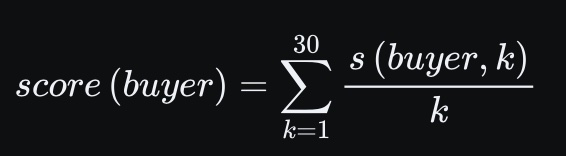
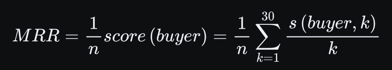
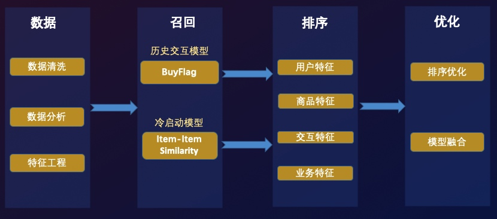
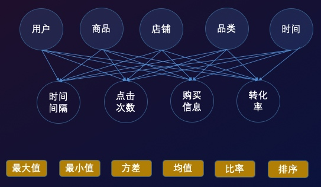
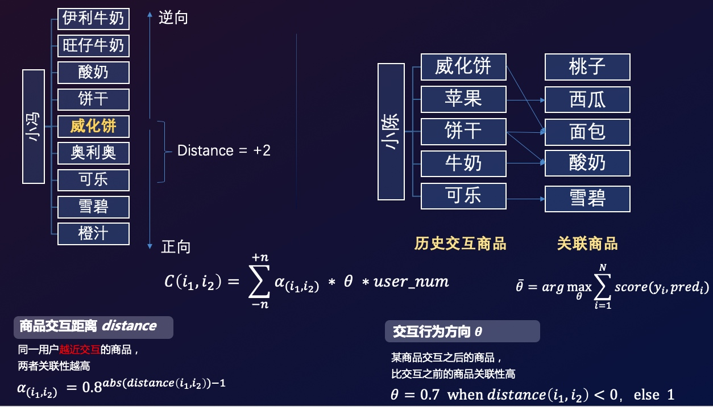
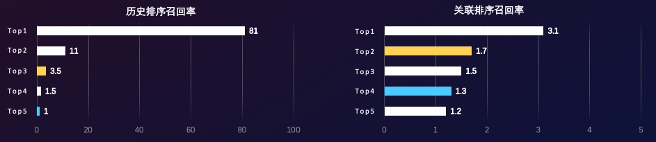
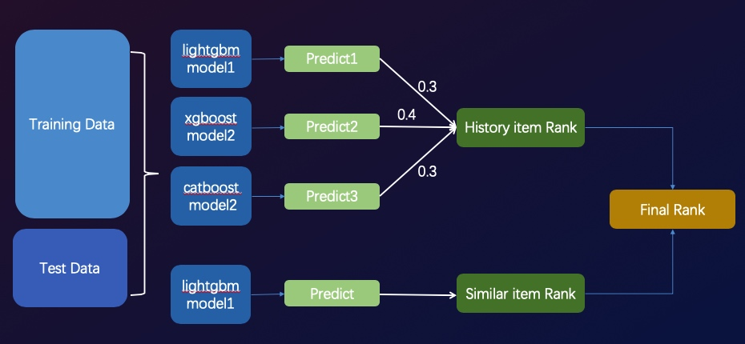
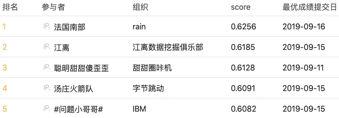

# 天池-安泰杯跨境电商智能算法大赛冠军方案整理
本仓库整理了“天池-安泰杯跨境电商智能算法大赛”的冠军方案，在理解原有方案的基础上，对原仓库的代码以及目录结构做了一些修改，以便于快速跑通代码并理解方案内容。原仓库地址：https://github.com/RainFung/Tianchi-AntaiCup-International-E-commerce-Artificial-Intelligence-Challenge

比赛链接：[天池-安泰杯跨境电商智能算法大赛](https://tianchi.aliyun.com/competition/entrance/231718/introduction)

## 数据下载

如果没有参加这个比赛则无法在天池官网下载到比赛数据集，可以移步到这里下载：https://pan.baidu.com/s/18Z2mW8TFxwJvOWqmGXdPeg 提取码: iqrd，下载之后会得到一个名为`antai_data.zip`的压缩文件，拉取本仓库代码，然后在项目根目录创建一个名为`data`的目录，把刚才下载的`antai_data.zip`文件放进`data`目录，然后解压即可，具体操作如下：

```sh
git clone git@github.com:xhqing/antai-cup.git
cd antai-cup
mkdir data
cd data
unzip antai_data.zip
```

## 赛题

AliExpress是阿里巴巴海外购物网站，海外用户可以在AliExpress挑选购买自己喜欢的商品。AliExpress积累了大量的用户行为数据，本赛题旨在通过海量数据挖掘用户下一个可能购买商品，选手们可以提交预测的TOP30商品列表，排序越靠前命中得分越高。

## 赛题目标

预测用户下一次可能会购买的商品。

### 赛题数据

共7个文件。

第一轮初赛共4个文件：训练数据(Antai_AE_round1_train_20190626.csv)、测试数据(Antai_AE_round1_test_20190626.csv)、商品信息(Antai_AE_round1_item_attr_20190626.csv)、提交示例(Antai_AE_round1_submit_20190715.csv)

第二轮复赛共3个文件：训练数据(Antai_AE_round2_train_20190813.csv)、测试数据(Antai_AE_round2_test_20190813.csv)、商品信息(Antai_AE_round2_item_attr_20190813.csv)

1. 训练数据：用户每次购买的商品id，订单日期以及用户国家标识

2. 测试数据：较于训练数据，测试数据剔除了模型需要预测的最后一次用户购买记录

3. 商品信息：商品id、品类id、店铺id和商品价格

4. 提交示例：预测用户购买商品Top30的item_id依概率从高到低排序，buyer_admin_id, predict 1, …, predict 30

根据零售行业的**人货场**概念，赛题提供了关于用户行为日志的常见字段可分为如下部分：
* 用户：用户标识、用户国籍
* 商品：商品标识、店铺、品类、价格
* 场景：点击时间、访问排序、购买标记

评分公式采用MRR(Mean Reciprocal Rank)指标。

首先对选手提交的表格中的每个用户计算用户得分，计算方式如下：



其中, 如果选手对该buyer的预测结果predict k命中该buyer的最后一条购买数据则s(buyer,k)=1，否则s(buyer,k)=0。

而选手最终得分为所有这些score(buyer)的平均值，也即MRR得分，计算如下：



其中，n为buyer的数量。

### 赛题分析
通过对赛题数据进行探索和分析，我们发现可以根据**预测商品是否在历史交互过**分成两种不同分布的用户：

*  历史交互用户：即预测商品用户曾经已交互过，在召回-排序阶段：
召回：可通过buy_flag=1，将交互商品全量召回
排序：基于用户商品交互信息，解决排序问题，预测精度高

* 冷启动用户：即预测商品用户从未交互过，在召回-排序阶段：
召回：基于商品关联信息召回，召回难度大
排序：基于用户最近交互商品与关联信息进行排序，预测精度较低

方案思路：面对两种不同分布的用户，我们因地制宜基于不同样本和特征分别建立两个排序模型，然后再通过用户判断模型对两个排序的结果进行优化。



## 数据
### 数据分析
相关数据分析和可视化参见：`eda`目录。

这里建议新建一个Python虚拟环境(这里建议使用pipenv)，然后安装requirements.txt，建议的具体操作如下：

```sh
# 在本仓库根目录执行以下操作
pipenv --python 3.9.12 # 或 pipenv --python path/to/python, python 版本建议3.9.12 
pipenv run pip install -r requirements.txt

# 安装jupyterlab的kernel
pipenv run python -m ipykernel install --name antai-cup # pipenv的 .venv/ 如果放在项目根目录，则虚拟环境的名字就是项目目录的名字，具体的需要了解pipenv的使用

# 成功安装jupyterlab的 `antai-cup` kernel后, 刷新一下浏览器，在jupyterlab界面右上角kernel选择`antai-cup`即可在jupyterlab里面使用虚拟环境了 

# eda 目录下的 eda_round1.ipynb 和 eda_round2.ipynb 分别是第一轮初赛数据和第二轮复赛数据的探索分析
```

### 特征工程
赛题所给的字段相对简单，主要可分为：用户-商品-场景，我们通过对不同类型因素进行交叉复合，并使用基础统计手段进行计算，构造出高阶特征，提取出购物决策的相关信息：



## 模型
### 历史交互商品模型
* 样本构造：提取buy_flag=1的user-item作为样本，用户最后交互的设为正样本，其他为负样本

* 模型信息：
 - 训练集样本数：137W
 - 训练集用户数：55W
 - 测试集样本数：3.1W
 - 测试集用户数：8944
 - 特征数量：425
 - Model：LightGbm 
 - loss function：AUC

* 模型效果：
AUC: 0.9493
MRR: 0.8922
Recall Rate：
 - Top1 item：81%
 - Top3 item：92.5%
 - Top10 item：99%

### 关联商品模型
key：挖掘商品间关联关系，根据用户历史交互商品，推荐关联商品

* Item-Item similarity Based on Sequnence
商品相似性：基于用户行为序列计算，假设用户越近交互的两个商品相似性越高，并且考虑先后次序，通过线性搜索得到如下相似度计算公式：




* 样本构造：对用户最近5个交互商品的关联商品(加上时间衰减权重)，选取每个用户TOP50关联商品，之前得到的关联度中间结果直接作为特征训练排序模型

* 模型信息：
 - 训练集样本数：940W
 - 训练集用户数：18W
 - 测试集样本数：47W
 - 测试集用户数：8944
 - 特征数量：222
 - Model：LightGbm 
 - loss function：AUC

* 模型效果：
AUC: 0.9736
MRR: 0.0554
Rcall Rate：
 - Top1 item：3.1%
 - Top3 item：6.3%
 - Top30 item：15%


## 优化
### 排序优化


如图所示，历史商品模型排序第4的商品召回率仅有1.5，而关联模型排序第一位召回率为3.1。
为了优化排序结果，优化两部分模型的结果，通过**用户判别模型(预测用户是否为冷启动用户)**，对概率大于0.95的高置信度用户直接截取掉历史TOP3后，与商品与关联模型的结果进行拼接，得到最终的Top30商品排序。

### 模型融合
* Enseblem
对于历史交互商品模型，训练了LightGBM、Xgboost、CatBoost三个模型，通过对预测结果简单加权进行融合。



* Stacking
此外，在每个模型训练过程中通过简单Stacking将其他4折的预测结果作为特征反喂模型，进一步拟合结果。

通过优化阶段，我们将分数从0.6198提升到0.6256，进一步拉开了与其他队伍的差距。




## 总结
在本次比赛前期，我花费了大量精力进行数据探索和分析，基于对数据和业务的了解才确立了最终的方案和优化路线。当对数据之间的联系了然于心后，开始进行细致的特征工程以提取各种信息，在也是历史交互模型得分提升的关键。此后，为了提高召回率，尝试了Embedding、协同过滤等方法，但是由于数据量和category字段少的限制，都没取得太好的效果，开始基于业务理解，尝试建立关联度计算公式，通过不断搜索参数，取得了不错的召回率，由此建立关联商品模型，此时成绩也上升到第一名。最后阶段，我们开始提高模型的精度和稳定性，一是建立了用户判别模型对排序进行了优化，二是对模型进行了融合以及stacking，得到了0.6256分数，进一步扩大了领先优势。

